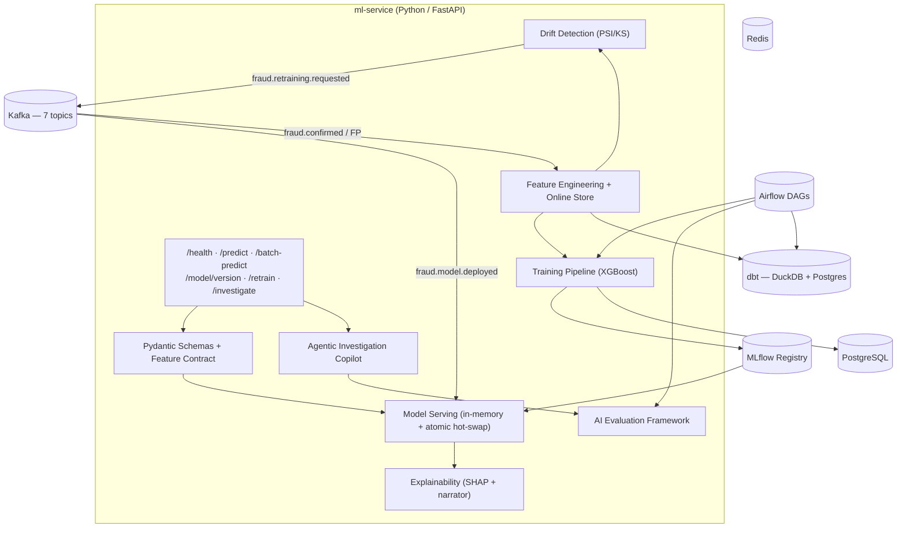

# ml-service — AI/ML Plane for the Fraud Prevention Platform

[](https://github.com/bragabruno/ml-service/actions/workflows/ci.yml)
[](https://www.python.org/downloads/)
[](./LICENSE)

The AI/ML inference, training, drift detection, agentic investigation, and evaluation plane for the **AI-Powered Fraud Prevention Platform** — a sibling service to the Java/Spring Boot [`backend`](https://github.com/bragabruno/backend).

---

## Architecture



---

## JD Skill → Component Map

| JD Required Skill | Where It Lives | Platform Tie |
|---|---|---|
| **Agentic AI** | `src/ml_service/agent/` — tool-using Fraud Investigation Copilot | HITL / case-mgmt (EPIC-14/16) |
| **LLMs & AI Evaluation Frameworks** ⭐ | `eval/` — golden sets, LLM-as-judge, groundedness/hallucination metrics, CI gate | "Support AI model launches, testing" |
| **Prompt Engineering** | `prompts/` versioned registry + `agent/` + `explain/narrator.py` | Explainability (FRAUD-084/156) |
| **dbt** + **SQL** | `dbt/` — staging → feature mart → training mart → KPI marts | Feature parity (FRAUD-068) |
| **Airflow** | `airflow/dags/` — ETL, training, drift, eval DAGs | EPIC-11/12/18 orchestration |
| **Machine Learning** + **Data Science** | `src/ml_service/training/`, `drift/`, `explain/` | EPIC-10/11/18 |
| **Python** | entire service | EPIC-09 |
| **GitHub / CI/CD** | `.github/workflows/ci.yml` with eval-gate | EPIC-22 |

⭐ = highest-signal, rarest skill for this JD

---

## Quickstart

```bash
# 1. Clone and install
git clone https://github.com/bragabruno/ml-service.git
cd ml-service
make dev          # install all deps (dev + dbt + airflow)

# 2. Start infrastructure
docker compose up -d   # Postgres + Redis + MLflow

# 3. Generate synthetic data + build dbt marts
python -m data.generate_synthetic
make dbt

# 4. Train a model
make train

# 5. Serve predictions
make serve         # http://localhost:8000/docs

# 6. Run the full demo
make demo          # generate → dbt → train → serve → investigate → eval → report
```

## Secrets Management (Doppler)

All secrets are managed via [Doppler](https://www.doppler.com/) — never commit `.env` files with real credentials.

```bash
# 1. Install Doppler CLI
brew install dopplerhq/tap/doppler

# 2. Login
doppler login

# 3. Setup project (from repo root)
doppler setup --project fraud-prevention --config dev_main

# 4. Run with secrets injected
make serve         # or: doppler run -- uvicorn ...
```

For Docker Compose (from repo root):
```bash
doppler run -- docker compose up -d
```

---

## Repo Structure

```
ml-service/
├── src/ml_service/
│   ├── app/              # FastAPI (health, predict, investigate, model, explain)
│   ├── schemas/          # Pydantic: features, predict, investigation
│   ├── features/         # Feature contract, transforms, online/offline stores, parity
│   ├── serving/          # Model registry (MLflow) + in-memory serving + atomic hot-swap
│   ├── training/         # XGBoost + LogReg baseline, evaluate, tune, gate
│   ├── drift/            # PSI/KS feature + prediction drift monitoring
│   ├── explain/          # SHAP, importances, LLM narrator
│   ├── agent/            # Agentic AI: LLM client, tools, investigation loop, guardrails
│   └── events/           # Kafka consumer/producer
├── prompts/              # Versioned prompt templates (Jinja2)
├── eval/                 # AI evaluation framework (golden sets, metrics, judges, gate)
├── dbt/                  # dbt project (dual-target: DuckDB + Postgres)
├── airflow/dags/         # Airflow DAGs (feature, training, drift, eval)
├── data/                 # Synthetic data generator
├── scripts/              # demo.sh
├── tests/                # pytest
└── docs/                 # ARCHITECTURE.md, EVALUATION.md, PROMPTS.md, MODEL_CARD.md, ADRs
```

---

## Platform Contracts

| Contract | Value |
|----------|-------|
| **Feature contract** | `features/contract.py` → JSON artifact, asserted against dbt training mart |
| **`/predict` payload** | Features in → `fraudProbability`, `riskLevel`, `modelVersion`, `contributingFactors` out |
| **Kafka topics** | `transactions.created`, `fraud.scored`, `fraud.review.required`, `fraud.confirmed`, `fraud.falsepositive`, `fraud.retraining.requested`, `fraud.model.deployed` |
| **Domain tables** | 9 tables: users, transactions, devices, merchants, risk_scores, fraud_cases, fraud_labels, model_versions, audit_events |
| **Enums** | `Decision{APPROVE,REVIEW,DECLINE}`, `LabelType{FRAUD,LEGITIMATE}`, `ModelStatus{REGISTERED,APPROVED,DEPLOYED,ROLLED_BACK,ARCHIVED}` |

---

## LLM Provider

| Provider | Env Var | Use Case |
|----------|---------|----------|
| `mock` (default) | `LLM_PROVIDER=mock` | Offline, deterministic, reproducible evals |
| `anthropic` | `LLM_PROVIDER=anthropic` + `ANTHROPIC_API_KEY` | Real Claude for production |

---

## Documentation

- [`docs/ARCHITECTURE.md`](docs/ARCHITECTURE.md) — How ml-service fits the platform
- [`docs/EVALUATION.md`](docs/EVALUATION.md) — Eval methodology: metrics, judge rubrics, gating policy
- [`docs/PROMPTS.md`](docs/PROMPTS.md) — Prompt design rationale + changelog
- [`docs/MODEL_CARD.md`](docs/MODEL_CARD.md) — Fraud model card
- [`docs/ADR/`](docs/ADR/) — Architecture Decision Records

---

## License

MIT — [BragDev LLC](https://github.com/bragabruno)
