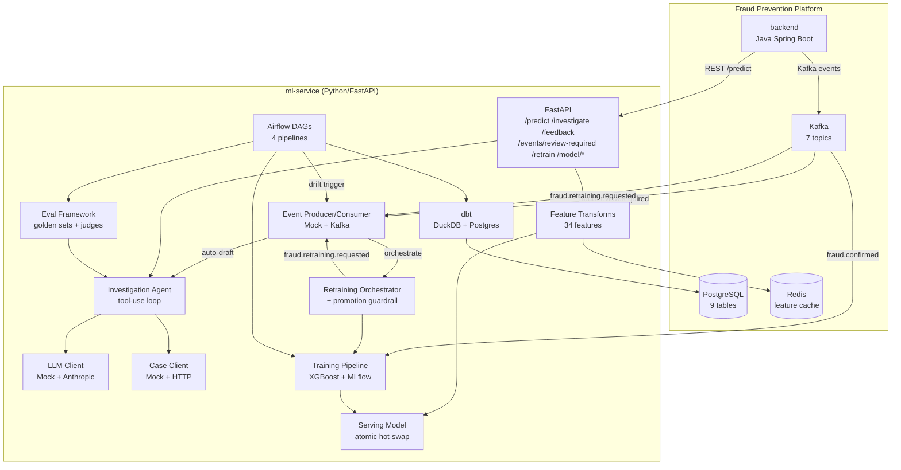
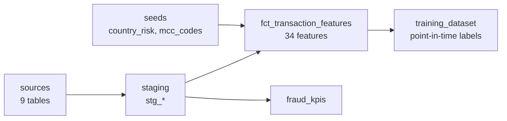
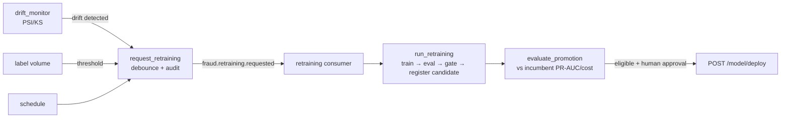
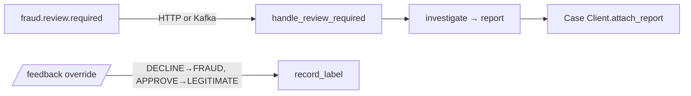

# Architecture — `ml-service`

## System Context

`ml-service` is the AI/ML plane of the Fraud Prevention Platform. It sits alongside the Java `backend` (Spring Boot) and provides:

1. **ML inference** — real-time fraud scoring via `/predict` (uncertain MEDIUM-band scores get an inline agent triage)
2. **Agentic investigation** — LLM-powered case analysis via `/investigate`
3. **HITL case integration** — `fraud.review.required` → auto-drafted report attached to the case; analyst overrides become labels via `/feedback`
4. **Offline analytics** — dbt feature/training/KPI marts
5. **Model training** — XGBoost + LogReg with MLflow registry
6. **Continuous learning** — drift/label-volume/schedule triggers emit `fraud.retraining.requested` (debounced + audited) → orchestrated train/evaluate/register → promotion guardrail (eligibility only; deploy stays human)
7. **AI evaluation** — golden datasets, LLM-as-judge, CI gates

## Component View

## Agent Tool-Use Sequence

## dbt DAG

## Airflow DAGs

| DAG | Schedule | Purpose |
|---|---|---|
| `feature_pipeline` | daily | dbt seed + run + test + parity |
| `training_pipeline` | weekly | dbt build → train → evaluate → gate → register |
| `drift_monitor` | weekly | PSI/KS drift → emit `fraud.retraining.requested` (debounced + audited) |
| `llm_eval` | weekly | eval runner → gate → report |

## Continuous-Learning Loop

Every stage is automated except the one that changes production — `deploy` stays a human action,
so upstream automation can recommend but never silently swap the serving model.

## HITL Auto-Draft

## Data Flow

1. **Online**: Transaction → backend → `/predict` → transforms → model → score → Kafka `fraud.scored` (MEDIUM-band scores also get an inline agent triage note)
2. **Offline**: Raw tables → dbt staging → feature mart → training dataset → XGBoost → MLflow → hot-swap
3. **Investigation**: Case flagged → `/investigate` → agent gathers evidence → LLM synthesizes report → HITL queue
4. **HITL auto-draft**: `fraud.review.required` → `handle_review_required` → agent report attached to the case; analyst override via `/feedback` → derived `FRAUD`/`LEGITIMATE` label
5. **Continuous learning (closed loop)**: drift/label-volume/schedule → debounced+audited `fraud.retraining.requested` → orchestrated train/evaluate/register candidate → promotion guardrail flags eligibility → human approves `POST /model/deploy`
