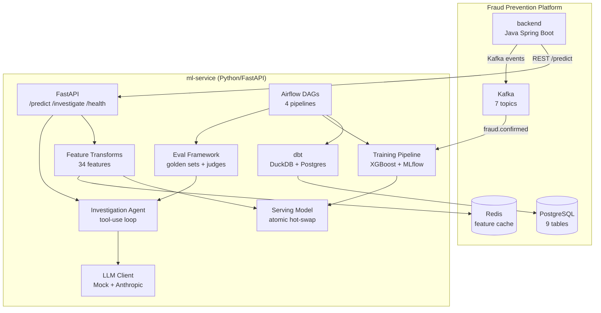
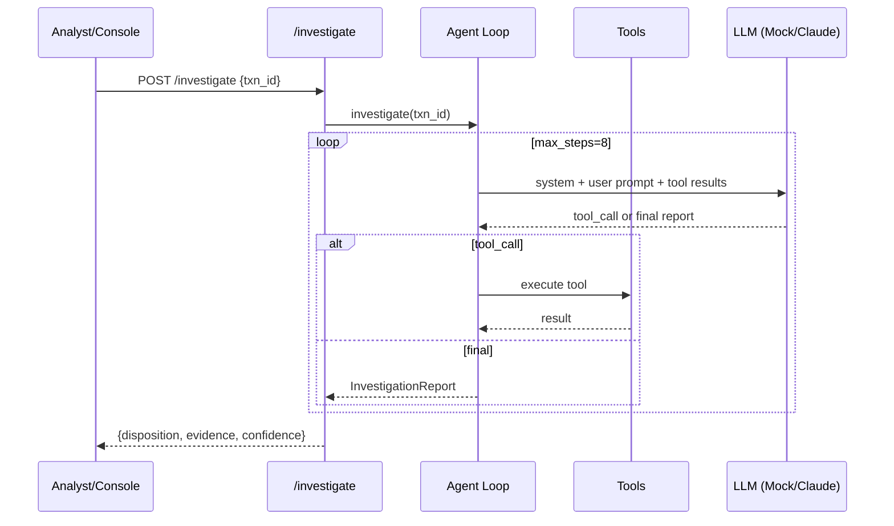
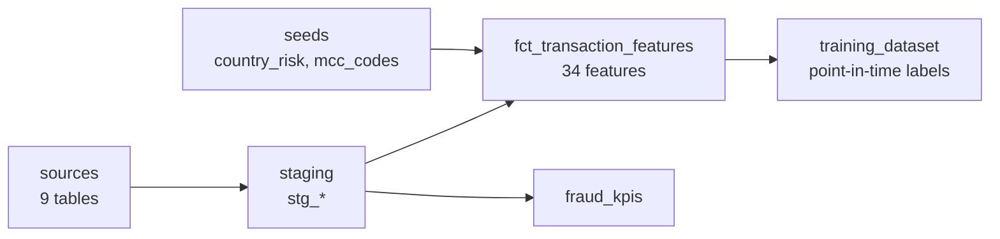

# Architecture — `ml-service`

## System Context

`ml-service` is the AI/ML plane of the Fraud Prevention Platform. It sits alongside the Java `backend` (Spring Boot) and provides:

1. **ML inference** — real-time fraud scoring via `/predict`
2. **Agentic investigation** — LLM-powered case analysis via `/investigate`
3. **Offline analytics** — dbt feature/training/KPI marts
4. **Model training** — XGBoost + LogReg with MLflow registry
5. **AI evaluation** — golden datasets, LLM-as-judge, CI gates

## Component View

## Agent Tool-Use Sequence

## dbt DAG

## Airflow DAGs

| DAG | Schedule | Purpose |
|---|---|---|
| `feature_pipeline` | daily | dbt seed + run + test + parity |
| `training_pipeline` | weekly | dbt build → train → evaluate → gate → register |
| `drift_monitor` | weekly | PSI/KS drift → alert → retraining trigger |
| `llm_eval` | weekly | eval runner → gate → report |

## Data Flow

1. **Online**: Transaction → backend → `/predict` → transforms → model → score → Kafka `fraud.scored`
2. **Offline**: Raw tables → dbt staging → feature mart → training dataset → XGBoost → MLflow → hot-swap
3. **Investigation**: Case flagged → `/investigate` → agent gathers evidence → LLM synthesizes report → HITL queue
